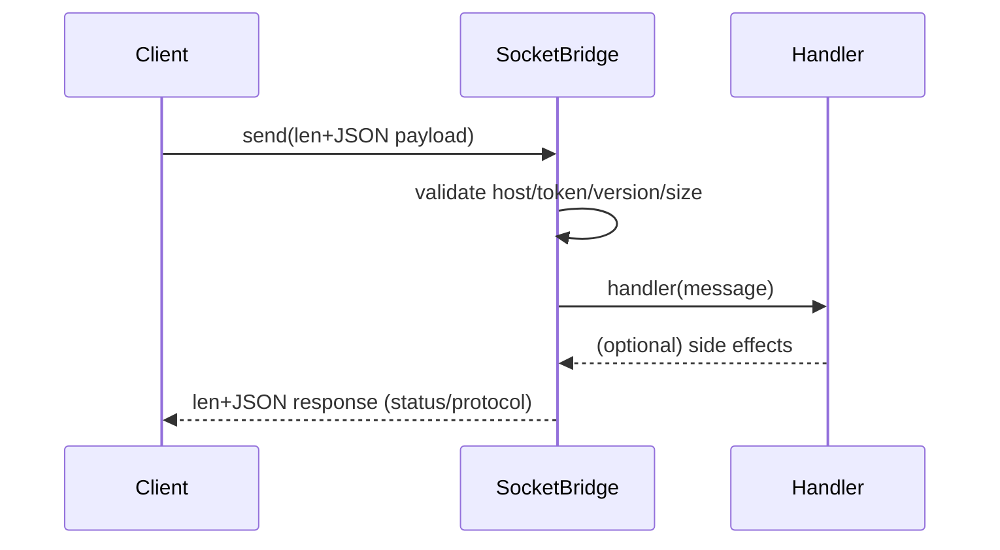

# SocketBridge

## What It Is

SocketBridge is a lightweight, stdlib-only TCP IPC   bridge for local agents and tools. It uses   length‑prefixed JSON, loopback-by-default binding,   auth tokens, host allowlists, max-bytes caps, and   protocol versioning. Ideal for side‑band control   channels and test harnesses—no external dependencies,   just Python.

## How It Works

- Length-prefixed JSON frames (no partial or merged reads)
- Loopback-by-default bind
- Auth token + host allowlist
- Max-bytes cap and protocol version check
## What It IsStart 2023-10-01 — Early CLI-piped coding assistant prototype. 100% complete; no open issues. Historical artifact that proves early tool-loop design.## How It Works- Start 2023-10-01 — Early CLI-piped coding assistant prototype. 100% complete; no open issues. Historical artifact that proves early tool-loop design.## What It IsStart 2023-10-01 — Original Oct 2023 local agent release. 100% complete; no open issues. Prompt-to-action loop with safe execution as the seed for later stacks.## How It Works- Start 2023-10-01 — Original Oct 2023 local agent release. 100% complete; no open issues. Prompt-to-action loop with safe execution as the seed for later stacks.## What It IsStart 2026-01-20 — Reusable scoring and rating engine. 100% complete; no open issues. Deterministic metrics, calibration flow, and audit-ready outputs.## How It Works- Start 2026-01-20 — Reusable scoring and rating engine. 100% complete; no open issues. Deterministic metrics, calibration flow, and audit-ready outputs.## What It IsStart 2025-12-17 — Full-stack scoring engine with heuristics, caches, CLI/GUI, and evaluation flow. Multi‑signal weighting, role balancing, and draft optimization with explainable outputs. Designed to stress-test ranking logic, iteration velocity, and production‑grade scoring pipelines.## How It Works- Start 2025-12-17 — Full-stack scoring engine with heuristics, caches, CLI/GUI, and evaluation flow. Multi‑signal weighting, role balancing, and draft optimization with explainable outputs. Designed to stress-test ranking logic, iteration velocity, and production‑grade scoring pipelines.## What It IsStart 2023-09-29 — Foundational local automation agent with prompt-to-action loops. 100% complete; no open issues. Compact architecture with command extraction, safety gates, and retry flow.## How It Works- Start 2023-09-29 — Foundational local automation agent with prompt-to-action loops. 100% complete; no open issues. Compact architecture with command extraction, safety gates, and retry flow.## What It IsStart 2026-01-12 — Reusable agent/data template. 100% complete; no open issues. Standardized CLI/GUI, config, docs, and validation scaffolding.## How It Works- Start 2026-01-12 — Reusable agent/data template. 100% complete; no open issues. Standardized CLI/GUI, config, docs, and validation scaffolding.## What It IsBuild a Rust-first, low-latency Polymarket arbitrage engine where latency is the first gate. The system hunts long-tail mispricings, executes two-leg trades with strict risk controls, and proves positive EV through auditable logs and iteration. No LLMs in the hot path.## How It Works- See README sections below for details on components and flow.## What It IsStart 2026-01-15 — Emulator-driven RL lab with OCR/vision, control loops, and reward shaping. Full environment interface, action abstraction, and telemetry for rapid iteration. Built to validate agent behaviors, stabilize training loops, and prove applied RL engineering under constraints.## How It Works- Start 2026-01-15 — Emulator-driven RL lab with OCR/vision, control loops, and reward shaping. Full environment interface, action abstraction, and telemetry for rapid iteration. Built to validate agent behaviors, stabilize training loops, and prove applied RL engineering under constraints.## What It IsStart 2026-01-06 — Local multimodal agent with perception → planning → humanized execution. OCR, UI state parsing, local model routing, and action intent loops with safety gates. Engineered to generalize across UI tasks while preserving human-like input patterns and pacing.## How It Works- Start 2026-01-06 — Local multimodal agent with perception → planning → humanized execution. OCR, UI state parsing, local model routing, and action intent loops with safety gates. Engineered to generalize across UI tasks while preserving human-like input patterns and pacing.## What It IsSocketBridge is a lightweight, stdlib-only TCP IPC   bridge for local agents and tools. It uses   length‑prefixed JSON, loopback-by-default binding,   auth tokens, host allowlists, max-bytes caps, and   protocol versioning. Ideal for side‑band control   channels and test harnesses—no external dependencies,   just Python.## How It Works- Length-prefixed JSON frames (no partial or merged reads)- Loopback-by-default bind- Auth token + host allowlist- Max-bytes cap and protocol version check- Zero dependencies (pure Python stdlib)

Lightweight, stdlib-only TCP IPC bridge for local agents and tools.

## Features
- Length-prefixed JSON frames (no partial or merged reads)
- Loopback-by-default bind
- Auth token + host allowlist
- Max-bytes cap and protocol version check
- Zero dependencies (pure Python stdlib)

## Quick Start (once published)
```bash
pip install socketbridge
```

```python
from socketbridge.server import SocketServer

def handler(message):
    print("got", message)

srv = SocketServer("127.0.0.1", 7002, handler=handler)
srv.start()
# ... send messages with an auth_token ...
srv.stop()
```

Client helper (planned):
```python
from socketbridge.client import send
resp = send("127.0.0.1", 7002, {"type": "ping"}, token="secret")
print(resp)
```

## Examples
- `examples/example_server.py` — minimal server that echos back notifications.
- `examples/example_client.py` — sends a JSON payload with optional auth token.

Run them:
```bash
python examples/example_server.py &
python examples/example_client.py --text "hello" --token secret
```

## Security Defaults
- Binds 127.0.0.1 unless you override host
- Optional auth token via `SOCKETBRIDGE_TOKEN`
- Optional allowlist via `SOCKETBRIDGE_ALLOWLIST` (comma separated)
- Payload cap via `SOCKETBRIDGE_MAX_BYTES` (default 1MB)
- Not for internet-facing use without additional hardening (TLS/mTLS)

## Architecture (conceptual)
```
Client
  |
  | 4-byte length + JSON (auth_token, protocol_version, payload)
  v
SocketBridge Server (loopback, token/allowlist/max-bytes)
  |--> handler(message)   # your code runs here
  |
  ^ 4-byte length + JSON response (status, message, protocol_version)
```

Mermaid sequence (for docs that render it):


## Why
Provides a clean side-band channel for agents, test harnesses, and helper processes without touching stdout/stderr or adding external dependencies.

## License
MIT
